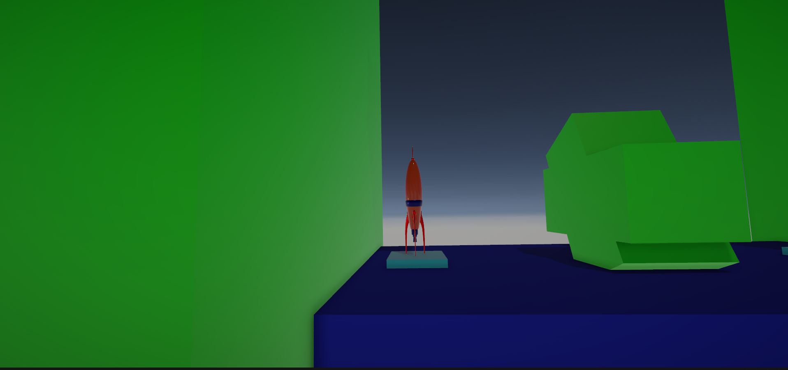
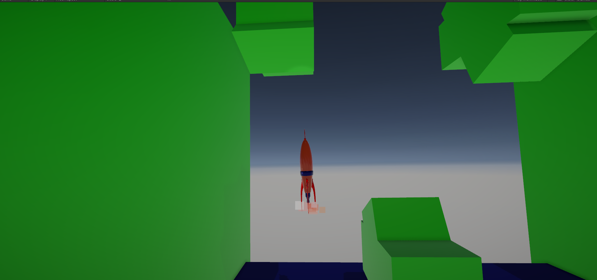
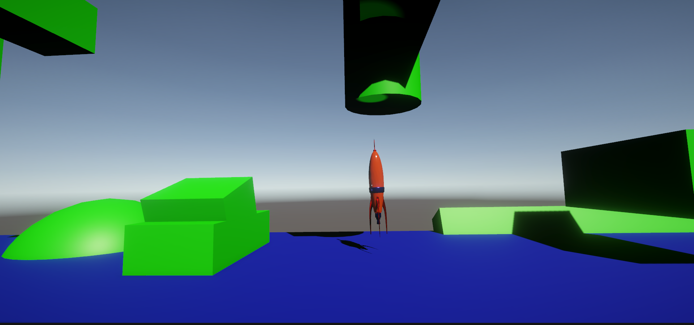
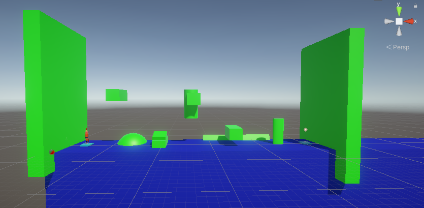

# Space Ship Fun

## Introduction

Space Ship Fun is an exciting physics-based game developed using Unity with Universal Render Pipeline (URP). In this game, players will navigate a spaceship through challenging obstacles using realistic physics simulations and stunning visual effects created with particle systems and basic lighting.

## Screenshots

Check out some in-game screenshots below:

## Features

- Realistic physics-based gameplay.
- Stunning visual effects using particle systems.
- Intuitive controls for an immersive gaming experience.
